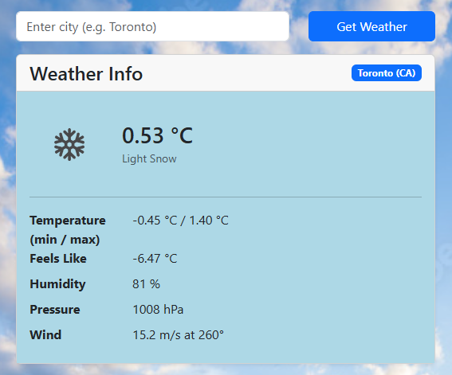
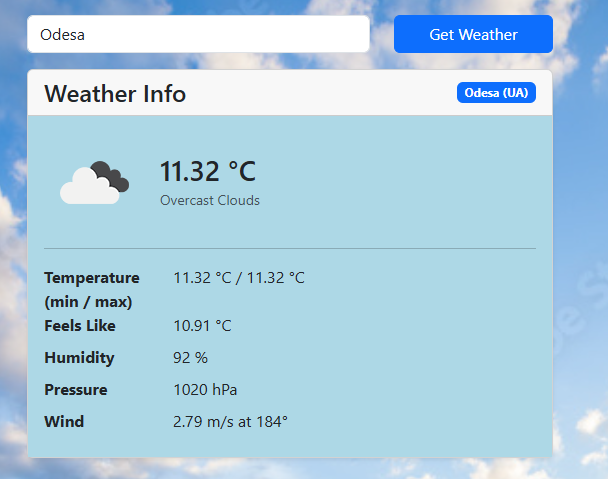
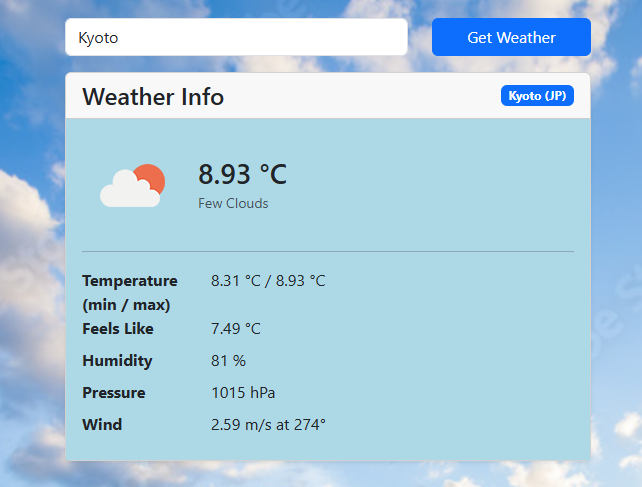

# COMP3123 Full Stack - Lab Test 2
## Student Information
- Student: Daniil Orlov
- Id: 101500729
- Instructor: Pritesh Patel

## Project Description
- Summary: React Application that shows the user a brief weather summary of the chosen city
- Default location: Toronto
     - Search bar allows user to enter the required city
     - Information will not be updated if the city name is entered incorrectly (city doesn't exist in the API database)
- API used: OpenWeatherMap
     - Link: https://openweathermap.org/
- Deployed on Vercel
     - Link: (link will be here)

## Setup
Follow these steps if you want to run the project yourself  
1. Create an account with OpenWeatherMap API and get your public key
2. Download of fork this project from GitHub
3. In the `root project directory` create `.env` file, and add the API key there in the following format: `REACT_APP_API_KEY=your_api_key` (no spaces, brackets, or quotes)
4. Open your terminal, and navigate to the project directory
5. Run ` npm i ` to recreate node_modules
6. Run ` npm start ` to start the project in your terminal
7. ???????
8. The application should now be up and running. Good luck!

## Example Screenshots:

